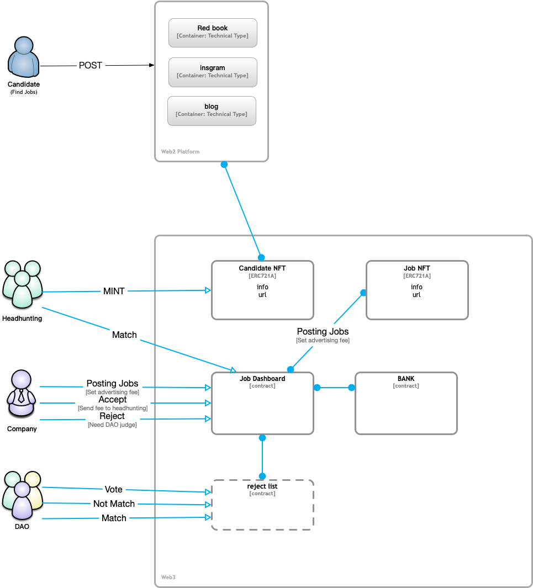

# HeadhuntingDAO
Decentralized Executive Search

## Steps

### Overall

1. Candidate will post them resume to web2 Platform (like Red book/ instagram/ personal blog)
2. Headhunters will collect information mint a Candidate NFT
3. Company colud post jobs and mint a Job NFT, and deposite fees
4. Headhunters will match candidates according to job conditions
5. Company can choise accecpt or reject.
6. It will send fees to headhunter when company accecpted candidate.
7. The DAO will vote reject job when company reject.

### Company

1. Deposite or withdrow money from bank
2. Setting job fees

### DAO

1. Determine whether the rejected candidate meets the job requirements
2. Vote

